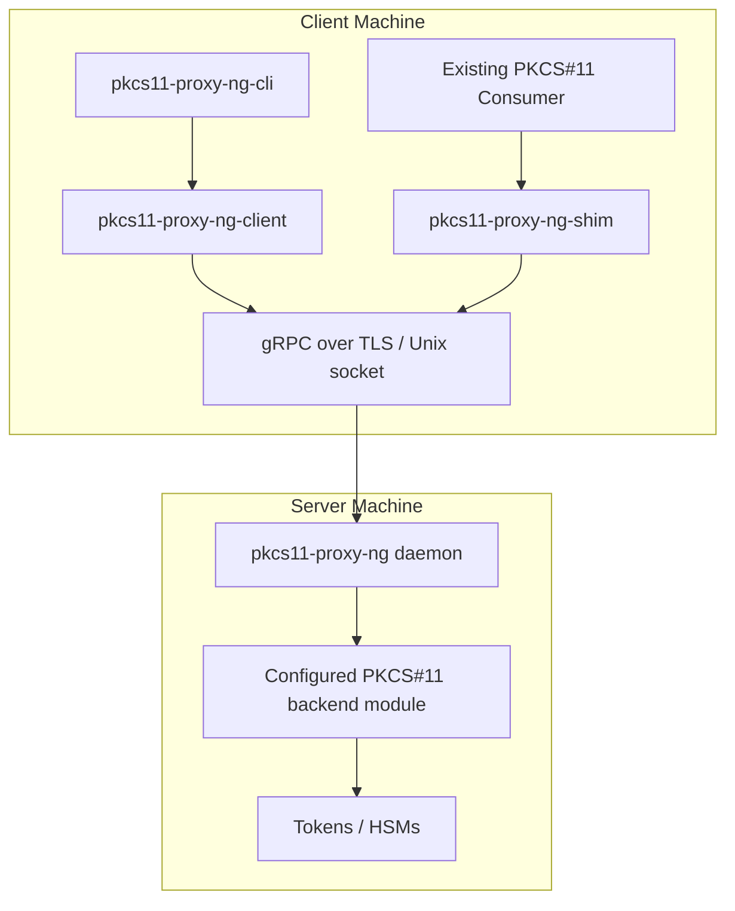

**Rust PKCS#11 Remote Proxy**  
**Product Requirements Document (PRD)**  
**Version 1.1** — March 2026

### 1. Overview / Purpose
The **Rust PKCS#11 Remote Proxy** is a modern, memory-safe, Rust-native remoting and compatibility layer for PKCS#11.

Its purpose is to let applications and infrastructure teams use PKCS#11 tokens and HSMs across process and machine boundaries without depending on legacy remoting flows or vendor-specific integration patterns.

The product thesis is:

- remote PKCS#11 access is a real operational need in distributed and containerized systems
- existing remoting options are fragmented, platform-skewed, or hard to integrate cleanly
- the newest PKCS#11 standard surface needs explicit and safer handling, especially for complex mechanism parameters
- a strong drop-in compatibility layer is more important than a language-specific SDK alone

The initial design partner is an internal PKI platform with real HSM-backed signing and key-management workflows. The project should be shaped by that concrete production use case first, then generalized for broader adoption.

### 2. Objectives
- Provide secure remote PKCS#11 access for distributed and containerized workloads.
- Deliver a safer remoting model by explicitly modeling supported mechanisms, attributes, and parameter structures.
- Support a tested subset of PKCS#11 2.40, 3.0, and 3.2 in phase 1, with a clear expansion path.
- Deliver a modern Rust client library and CLI for development, testing, and automation.
- Deliver a drop-in PKCS#11 shim for validated consumers, starting with Linux.
- Reuse mature backend components where appropriate instead of rebuilding module aggregation logic.

### 3. Product Positioning
This project is **not** primarily a PQC-only tool.

PQC support is important, especially for current and near-future PKCS#11 3.2 adoption, but the main value is broader:

- network-native PKCS#11 access
- safer handling of the latest standard surface
- cross-process and cross-machine compatibility
- better developer and operator ergonomics
- a practical migration path for existing PKCS#11 consumers

### 4. Primary Users
#### 4.1 Phase 1 Primary User
- An internal PKI platform team that needs remote access to HSM-backed PKCS#11 operations from distributed services and automation flows.

#### 4.2 Secondary Future Users
- Infrastructure teams centralizing access to tokens on separate machines.
- Security engineering teams that need auditability and tighter operational control around PKCS#11 usage.
- Application teams using Rust, Go, Python, Java, or C/C++ software that already expects a PKCS#11 module.

### 5. Initial Use Cases
1. Run core PKCS#11 signing workflows remotely for PKI services that cannot be colocated with the HSM client stack.
2. Perform key generation, object listing, object lookup, and session/login workflows through a stable remote interface.
3. Provide a validated Linux drop-in shim for selected existing PKCS#11 consumers.
4. Use a modern CLI and Rust client library for integration testing, diagnostics, and automation.
5. Add support for PKCS#11 3.2 mechanisms, including PQC-related functions, where the backend and validation matrix support them.

### 6. Phase 1 Scope
Phase 1 is intentionally narrower than "full PKCS#11 support".

#### 6.1 In Scope
- Linux daemon
- Linux client-side shim
- Rust client library
- CLI
- gRPC transport over Unix socket and TLS-secured TCP
- explicit supported subset of PKCS#11 2.40, 3.0, and 3.2
- compatibility validation against a defined matrix of tools and applications
- support for standard PKCS#11 backend modules, including vendor HSM libraries
  and optional use of p11-kit

#### 6.2 Out of Scope
- universal application compatibility on day one
- full PKCS#11 conformance across every function, mechanism, and structure
- automatic support for future PKCS#11 versions without explicit implementation work
- direct wire compatibility with p11-kit's RPC protocol
- built-in token implementation
- Windows and macOS parity in phase 1

#### 6.3 Selected v0.2 Native Boundary (2026-09-13)

The [native ownership contract](doc/release/native-mechanism-ownership.md)
is required for v0.2; implementation and native qualification remain pending.
Live production FFI is limited to qualified Linux GNU/musl x86_64/64-bit and
x86/32-bit (i686). This supersedes Windows native-provider daemon support in
ADR-0011/0006 for this release. Portable Windows client/shim/proto/types and
mock-only backend/server builds remain, including Windows clients using a
qualified Linux daemon.

[Tail-stretch closure, 2026-09-17: the Windows deferral above was the
2026-09-13 posture — ADR-0014 is Implemented, re-admitting the Windows
x64/MSVC native daemon and the Windows client shim to the v0.2.0 tail
stretch, qualified on real Windows Server 2022 (T6 legs A/B/C receipts in
workspace-root `artifacts/v020-tail-windows-2026-09-16/`).]

One managed provider chain per embedding process, reserved before loading or
discovery, owns lifecycle and retirement. Callers share one backend via Arc;
multiple linked runtime copies, unmanaged native calls and shared downstream
aggregator aliases are outside the supported environment. Independent chains
use separate processes. Unresolved native lifetime requires the qualified
return-aware raw Linux `exit_group(70)` whole-process stop with no cleanup,
wiping or audit-tail guarantee under its explicit environment limits.

Slot-event support is `CKF_DONT_BLOCK` only: blocking mode returns local
FUNCTION_NOT_SUPPORTED without polling. The sole supported waiter retains
ordinary lifecycle exclusion, and input/output/RV widths are checked. Clients
compete for one native pending-event source; logical Initialize does not create
an independent event bitmap. No full native per-application event equivalence
is promised. The linked contract specifies precedence, canaries, retirement
and all four Linux loaded-shim topology/native stop release gates.

### 7. Functional Requirements
#### 7.1 Workspace Components
The implementation is expected to live in a Cargo workspace with four primary crates:

- `pkcs11-proxy-ng` — daemon binary
- `pkcs11-proxy-ng-client` — safe Rust client library
- `pkcs11-proxy-ng-cli` — CLI
- `pkcs11-proxy-ng-shim` — Rust `cdylib` exposing the PKCS#11 C API

#### 7.2 Backend Model
The daemon loads and dispatches to standard **PKCS#11 backend modules**.

Primary operational targets are vendor HSM/client libraries and other standard
PKCS#11 modules. `p11-kit` may be used where it adds value, but it is not a
special architectural dependency and not the primary target.

The backend model is intended to support:

- module loading
- backend capability discovery
- slot discovery
- direct use of vendor-provided PKCS#11 libraries
- optional use of module aggregators such as `p11-kit`

The Rust layer should treat all of these as standard PKCS#11 module paths
rather than coupling the design to any single backend ecosystem.

#### 7.3 Protocol
- Primary transport: **gRPC + Protocol Buffers**
- Service versioning by major API generation (`v1`, `v2`, ...)
- Backward-compatible field evolution within a major version
- Explicit negotiation or compatibility check during connection setup
- Clear distinction between transport-supported features and backend-visible features

The compatibility goal is:

- clients built against `v1` continue to work with newer daemons for the `v1` feature set

This is a compatibility target, not an unlimited guarantee across future unsupported features.

#### 7.4 PKCS#11 Coverage Policy
Phase 1 targets an explicit, tested subset of PKCS#11 2.40, 3.0, and 3.2.

The project must publish:

- supported functions
- supported mechanisms
- supported mechanism parameter structures
- supported attributes and object classes
- explicitly unsupported items

The project must not claim "full support" until it has both implementation and validation evidence.

#### 7.5 Mechanism and Attribute Safety Policy
To avoid unsafe or brittle forwarding of unknown structures:

- maintain an explicit allow-list of supported mechanisms and attributes
- classify mechanisms by parameter behavior
- reject unsupported or unknown mechanisms instead of forwarding opaque data blindly
- serialize only explicitly modeled parameter structures
- enforce the allow-list at operation time (the no-raw-forward rule):
  discovery defaults to **transparent** (full backend list, including the
  shim) while unmodeled parameterized calls are rejected with
  `CKR_MECHANISM_PARAM_INVALID`; `mechanism_discovery = "filtered"` is the
  opt-in strict-discovery mode (ADR-0001 §4)

This policy is a core design principle, not an implementation detail.

#### 7.6 Handle and Session Semantics
The system must define and document:

- session handle lifecycle
- object handle lifecycle
- slot identity behavior
- reconnect behavior
- token-removal and backend-change behavior
- login state behavior

These semantics must be stable and testable because they are more important than the transport itself for compatibility.

#### 7.7 Drop-in Compatibility
The shim is intended to provide standard PKCS#11 consumer compatibility, but support must be described through a validation matrix rather than a blanket claim.

Phase 1 should validate at least:

- `pkcs11-tool`
- `p11tool`
- one OpenSSL-based path
- one internal production consumer from the design-partner environment

#### 7.8 PQC and Newer Standard Features
The project should support PKCS#11 3.2 features where:

- the backend exposes them
- the transport explicitly models them
- the validation matrix covers them

PQC support is important, but it should be shipped as tested standard coverage rather than marketed as the whole product.

### 8. Security Requirements
- TLS 1.3 for remote TCP connections
- support for mTLS
- Unix socket transport for local high-trust deployments
- explicit authentication and authorization model before production use
- request size limits, timeouts, and defensive handling for malformed or oversized requests
- redaction rules for PINs, credentials, and sensitive operation data
- audit-oriented structured logging for security-relevant events

The project must treat authorization and audit as product requirements, not later polish.

### 9. Non-Functional Requirements
- **Safety**: no unnecessary `unsafe` outside the shim boundary
- **Performance**: low overhead relative to local PKCS#11 usage for target production flows
- **Observability**: structured logs and tracing hooks
- **Compatibility**: validated behavior against a published compatibility matrix
- **Maintainability**: versioned protocol and explicit support tables
- **Portability**: Linux first, with a planned path to Windows and macOS after compatibility is proven

### 10. Success Criteria
Phase 1 should be considered successful when all of the following are true:

- the design-partner PKI workflow can use the proxy for its selected PKCS#11 operations in a realistic environment
- the supported PKCS#11 subset is documented and tested
- the Linux shim works with the initial compatibility matrix
- unsupported mechanisms and structures fail predictably and safely
- core operational controls exist: TLS/mTLS, logging, limits, and basic audit events

### 11. Architecture

### 12. Technical Stack
- Rust (stable)
- `tonic` + `prost`
- `clap`
- PKCS#11 Rust bindings or low-level FFI where required for full function coverage
- direct loading of standard PKCS#11 modules via FFI

The implementation should not depend on a high-level Rust PKCS#11 crate being complete for all required features.

### 13. Roadmap
**Phase 1: Production-shaped core**
- Linux daemon
- Rust client library
- CLI
- explicit supported PKCS#11 subset
- safety-first mechanism handling
- initial Linux shim
- design-partner workflow validation

**Phase 2: Compatibility and coverage**
- expand supported functions/mechanisms
- grow the compatibility matrix
- harden authz, audit, and operational controls
- add broader PKCS#11 3.x coverage, including selected PQC paths

**Phase 3: Broader platform support**
- Windows and macOS support
- more client libraries
- optional REST gateway or additional integration layers if still justified

### 14. Open Questions
- Which exact PKCS#11 functions are required for the first production workflow?
- Which applications and libraries define the initial compatibility matrix?
- What authorization model is required for production deployments?
- Which vendor modules and HSMs must be supported first?
- Is p11-kit protocol compatibility strategically useful later, or unnecessary?
